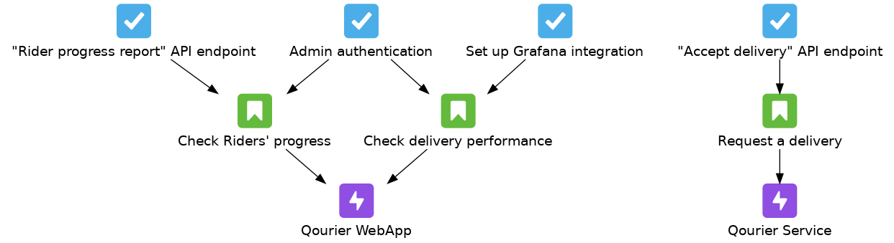

# Documentation

Documents detailing the project's various aspects, including the development workflow followed.

# Development conduct for QA

*Also detailed in the [QA Manual](qa_manual.pdf).*

The development of the project's increments follows a defined conduct in order to maintain code quality throughout the development cycle. We focus on a Behavior Driven Development (BDD) approach with the Gitflow workflow.
Below are the main points that were defined:
- Develop each feature (user story) on a separate branch, which will be later merged back into the respective development branch (`dev`)
    - The branch name should be `{qourier/laundryathome}_tqs-{Jira ID}_{user story title}`, e.g. `qourier_tqs-61_rider-profile-stats`
    - The first commits to these feature branches should only contain tests, incorporating the acceptance criteria defined in the respective user story. At maximum, the necessary project classes to use in the tests should only include the basic interface, without any implementation. Therefore, **the necessary files in these commits are**:
        - One Cucumber feature file incorporating the user story details in the project's test package directory, in a `cucumber` folder (e.g. `src/test/resources/org/project/app/cucumber`)
        - Any Java unit and integration tests for the classes involved in the realization of the user story
    - The merges to the development branch are done using Pull Requests (PRs), which will run an automated QA analysis to determine whether the increment meets the quality requirements. In case the analysis fails, the code should be fixed to pass the quality gates defined. The code will also be manually reviewed by the developers responsible for that development branch
    - The name of the pull requests done to the development branches should be `{Qourier/LaundryAtHome} | TQS-{Jira ID} | {user story title}`, e.g. `Qourier | TQS-61 | Rider profile stats`
- The commits should be prefixed with a label containing the Jira ID of the respective task being done (e.g. [TQS-22])
- All code should follow the Google Java Format coding style, with AOSP style indentation (4 spaces)

These practices should be applied for each of the two sub-projects (Qourier and LaundyAtHome), which are developed in parallel and by pairs.

The `release` branch will be automatically created, which will merge both development branches and create a PR to the `main` branch 2 days before the end of the current sprint. Pull requests done to the main branch also include the QA analysis (but the initial automatic opening of the PR doesn't trigger it). The Product Owner is automatically assigned to this PR as a reviewer, and the final merge to the `main` branch should be manually applied by them. The `dev` branches that are merged to `release` are distinct, but they should both successfully merge to it.

Because a branch will be created for each user story, there may be cases where multiple user stories, and therefore multiple branches, will have to develop the same functionality. This results in awkward organization of where (which branch) the functionality and the tests should be developed. Therefore, each user story is divided in tasks, which represent application functionality with greater granularity. With this in mind, we established that **user stories whose tasks intersect should not be done in parallel**. Below is an example of this user story organization:

Both the Qourier WebApp's user stories are dependent on the `Admin authentication` task. As a result, they should not be developed in parallel, but each of them can be developed in parallel with the `Request a delivery` user story.

Therefore, the development approach is iterative at the user story level, and incremental at the task level.
